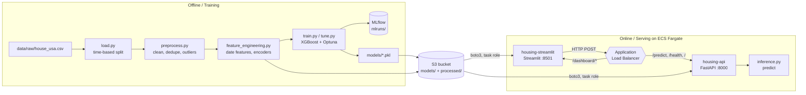

# Housing Price Regression — End-to-End ML

An end-to-end machine learning project that predicts US housing prices. It covers the full
lifecycle: data splitting, cleaning, feature engineering, model training and hyperparameter
tuning, experiment tracking, batch scoring, a REST API for serving, a Streamlit dashboard,
and containerised deployment to AWS ECS Fargate.

**Model:** XGBoost regressor, tuned with Optuna, tracked in MLflow.
**Serving:** FastAPI (predictions) + Streamlit (dashboard), both on ECS Fargate behind one ALB.

---

## Architecture



At container start both services download the model and processed datasets from S3 — they are
**not** baked into the images (except `models/*.pkl`, which are committed to git).

---

## Repository layout

```
.
├── app.py                        # Streamlit dashboard
├── src/
│   ├── api/main.py               # FastAPI app + endpoints
│   ├── feature_pipeline/
│   │   ├── load.py               # raw load + time-based train/dev/test split
│   │   ├── preprocess.py         # cleaning, dedupe, outlier removal
│   │   └── feature_engineering.py# date features, column pruning
│   ├── train_pipeline/
│   │   ├── train.py              # baseline XGBRegressor
│   │   ├── tune.py               # Optuna search + MLflow logging
│   │   └── eval.py               # metrics on the dev split
│   ├── inference_pipeline/
│   │   └── inference.py          # raw → features → predictions (+ CLI)
│   └── batch/run_monthly.py      # month-by-month batch scoring
├── notebooks/                    # 01–08, exploratory work behind each module
├── tests/                        # pytest suite
├── models/                       # trained model + encoders (committed)
├── mlruns/                       # local MLflow tracking store (committed)
├── Dockerfile                    # FastAPI image
├── Dockerfile.streamlit          # Streamlit image
└── .github/workflows/ci.yml      # build + push to ECR
```

`data/` is gitignored — datasets live in S3 and are fetched on demand.

---

## Local development

Requires **Python ≥ 3.13** and [uv](https://docs.astral.sh/uv/).

```bash
uv sync                  # create .venv and install from uv.lock
```

### Run the API

```bash
uv run uvicorn src.api.main:app --host 0.0.0.0 --port 8000
```

Open http://localhost:8000/docs for interactive docs.

### Run the dashboard

```bash
uv run streamlit run app.py
```

The dashboard reads `API_URL` (default `http://127.0.0.1:8000/predict`), so start the API first.

### Run the tests

```bash
uv run pytest tests/
```

> Tests read from `data/processed/`. Fetch the CSVs from S3 first, or they will skip/fail.

### AWS credentials

Both `src/api/main.py` and `app.py` create a boto3 S3 client **at import time** and download
artifacts immediately. Locally this uses your usual credential chain (`aws configure`, env vars,
SSO). Without valid credentials the app fails to start with `NoCredentialsError` — see
[Troubleshooting](#troubleshooting).

---

## ML pipeline

| Stage | Module | Notes |
|---|---|---|
| Split | `feature_pipeline/load.py` | **Time-based**, not random. Eval starts 2020-01-01 — avoids leaking future prices into training. |
| Preprocess | `feature_pipeline/preprocess.py` | `clean_and_merge`, `drop_duplicates`, `remove_outliers` |
| Features | `feature_pipeline/feature_engineering.py` | Date parts, drops unused columns |
| Encoding | applied in `inference.py` | Frequency encoding on `zipcode`, target encoding on `city_full` |
| Train | `train_pipeline/train.py` | Baseline `XGBRegressor` → `models/xgb_model.pkl` |
| Tune | `train_pipeline/tune.py` | Optuna minimising RMSE, logged to MLflow → `models/xgb_best_model.pkl` |
| Evaluate | `train_pipeline/eval.py` | MAE / RMSE / R² on the dev split |
| Batch | `batch/run_monthly.py` | Groups holdout by year-month → `data/predictions/preds_YYYY_MM.csv` |

The notebooks in [notebooks/](notebooks/) trace the exploration behind each step, ending with
`07_Hyperparameter_tuning_MLFlow.ipynb` and `08_S3_Push_Dataset_AWS.ipynb`.

Inference re-applies the **same** preprocessing chain as training, then reindexes to the training
schema (`df.reindex(columns=TRAIN_FEATURE_COLUMNS, fill_value=0)`) so unseen or missing columns
can't shift feature positions.

### Running inference from the CLI

```bash
uv run python -m src.inference_pipeline.inference \
  --input data/raw/holdout.csv \
  --output predictions.csv
```

---

## API reference

Base URL (deployed): `http://<your-alb-dns-name>`

| Method | Path | Description |
|---|---|---|
| `GET` | `/` | Liveness message. Also the ALB health check target. |
| `GET` | `/health` | Model presence + expected feature count |
| `POST` | `/predict` | Batch predictions. Body: JSON array of raw records. |
| `POST` | `/run_batch` | Triggers monthly batch scoring |
| `GET` | `/latest_predictions?limit=5` | Preview of most recent batch output |

`POST /predict` accepts a list of raw records (same schema as the holdout data) and returns:

```json
{ "predictions": [123456.0], "actuals": [120000.0] }
```

`actuals` is included only when the input contains a `price` column.

---

## Environment variables

| Variable | Used by | Default | Notes |
|---|---|---|---|
| `S3_BUCKET` | API, UI | `<your_S3_bucket>` | Source of models + processed data |
| `AWS_REGION` | API, UI | `<your AWS Region>` | |
| `API_URL` | UI | `http://127.0.0.1:8000/predict` | **Must include scheme and `/predict` path** |
| `STREAMLIT_SERVER_BASEURLPATH` | UI | `/dashboard` | Mounts the whole app under this prefix |
| `STREAMLIT_SERVER_PORT` / `_ADDRESS` | UI | `8501` / `0.0.0.0` | |

---

## S3 layout

Bucket: `<your_S3_bucket>` (`<your_AWS_region>`)

```
models/xgb_best_model.pkl                    # served model
processed/feature_engineered_train.csv       # training schema source (API)
processed/feature_engineered_test.csv        # dashboard holdout features
processed/cleaning_test.csv                  # dashboard holdout metadata
```

---

## Docker

```bash
docker build -t housing-api -f Dockerfile .
docker build -t housing-streamlit -f Dockerfile.streamlit .

docker run -p 8000:8000 \
  -e AWS_ACCESS_KEY_ID -e AWS_SECRET_ACCESS_KEY -e AWS_REGION=<your_AWS_region> \
  housing-api

docker run -p 8501:8501 \
  -e API_URL=http://host.docker.internal:8000/predict \
  -e AWS_ACCESS_KEY_ID -e AWS_SECRET_ACCESS_KEY -e AWS_REGION=<your_AWS_region> \
  housing-streamlit
```

Both images are `python:3.13-slim` — this must match `requires-python = ">=3.13"` in
`pyproject.toml`, or the dependency install fails to resolve.

The API image uses `uv sync --frozen` (a `.venv` at `/app/.venv`); the Streamlit image uses
`uv pip install --system`. If you change `pyproject.toml` you **must** regenerate `uv.lock`
(`uv lock`) or the `--frozen` build fails.

---

## CI/CD

[.github/workflows/ci.yml](.github/workflows/ci.yml) runs on every push to `main`:

1. Checkout
2. Configure AWS credentials (from repo secrets)
3. Log in to Amazon ECR
4. Build, tag, push **housing-api** — tagged `${GITHUB_SHA}` and `latest`
5. Build, tag, push **housing-api-streamlit** — same two tags

Required secrets: `AWS_ACCESS_KEY_ID`, `AWS_SECRET_ACCESS_KEY`, `AWS_REGION`.

Dual tagging is deliberate: the commit SHA gives reproducibility and traceability, `latest`
is the convenient pointer.

> **The pipeline builds and pushes but does not deploy.** ECS keeps running whatever revision
> its services point at. See [Deploying a new version](#deploying-a-new-version).

---

## AWS infrastructure

Created manually in the console (no IaC). This inventory exists so the environment can be
rebuilt or understood without clicking through the console.

### ECR

| Repository | Image |
|---|---|
| `housing-api` | FastAPI |
| `housing-api-streamlit` | Streamlit |

### ECS — cluster `housing-api-cluster-ecs` (Fargate)

| Service | Task definition | Container | Port |
|---|---|---|---|
| `housing-api-service` | `housing-api-task-ecs` | `housing-api-be` | 8000 |
| `housing-streamlit-service` | `housing-streamlit` | `housing-api-fe-streamlit` | 8501 |

Both: `X86_64`, `assignPublicIp: ENABLED`, deployment circuit breaker **on** with rollback.

Public IP is **required** — all three subnets are public and there is no NAT gateway, so
without it tasks cannot reach ECR and fail to start.

### IAM

| Role | Attached as | Purpose |
|---|---|---|
| `ecsTaskExecutionRole` | `executionRoleArn` | Pull images from ECR, write CloudWatch logs |
| `housing-api-role-s3-access` | `taskRoleArn` | **Application** S3 access via boto3 |

Both task definitions need `taskRoleArn`. Without it the container gets no credentials and
crashes at import with `NoCredentialsError`.

### Load balancing — `housing-api-alb` (internet-facing, HTTP :80)

| Rule | Priority | Path condition | Target group |
|---|---|---|---|
| 1 | 1 | `/predict*`, `/`, `/health*` | `housing-api-tg` |
| 2 | 2 | `/dashboard/*` | `housing-streamlit-tg` |
| default | — | everything else | `housing-api-tg` |

| Target group | Port | Health check path | Matcher |
|---|---|---|---|
| `housing-api-tg` | 8000 | `/` | 200 |
| `housing-streamlit-tg` | 8501 | `/dashboard/_stcore/health` | 200 |

> The Streamlit health check **must** be prefixed with the base URL path. Streamlit serves
> nothing at `/` when `STREAMLIT_SERVER_BASEURLPATH=/dashboard`, so a health check on `/`
> returns 404 → ECS kills the task → infinite restart loop.

### Subnets

Three subnets across separate availability zones, **all public**.

---

## Deploying a new version

CI pushes images; it does not move ECS onto them. Both task definitions currently pin images by
**digest** (`@sha256:...`), which is immutable — so `aws ecs update-service --force-new-deployment`
relaunches the *same* image and changes nothing.

To deploy a new image, register a new task definition revision and point the service at it:

```bash
IMAGE=<aws_account_id>.dkr.ecr.<your_AWS_region>.amazonaws.com/housing-api:<commit-sha>

aws ecs describe-task-definition --task-definition housing-api-task-ecs \
  --query taskDefinition > td.json

jq --arg IMG "$IMAGE" '.containerDefinitions[0].image = $IMG
  | del(.taskDefinitionArn, .revision, .status, .requiresAttributes,
        .compatibilities, .registeredAt, .registeredBy)' td.json > new-td.json

aws ecs register-task-definition --cli-input-json file://new-td.json
aws ecs update-service --cluster housing-api-cluster-ecs \
  --service housing-api-service --task-definition housing-api-task-ecs
aws ecs wait services-stable --cluster housing-api-cluster-ecs \
  --services housing-api-service
```

Describing without a revision returns the latest ACTIVE one, so the task role and environment
variables are inherited rather than lost.

**Rollback:** point the service at the previous revision.

```bash
aws ecs update-service --cluster housing-api-cluster-ecs \
  --service housing-api-service --task-definition housing-api-task-ecs:2
```

---

## Troubleshooting

Failure modes hit on this project, with the signal that identifies each.

**`NoCredentialsError` in container logs**
No credentials at all — not a permissions problem. A too-narrow policy produces `AccessDenied`
(403) instead. Check that the running revision has `taskRoleArn` set, and that the *service*
points at that revision (editing a task definition creates a new revision; it does not move
the service).

**Task starts cleanly, then `Stopping...` every few minutes**
No traceback in the logs means the app isn't crashing — the ALB is killing it. Check target
health: `Target.ResponseCodeMismatch ... [404]` means the health check path isn't served.

**Deployment "succeeds" but the change is gone**
The circuit breaker rolled back to the last good deployment. Look for `rolling back to
deployment` in `aws ecs describe-services --query 'services[0].events'`. Fix the health check
first, or every attempt reverts.

**ALB times out from the internet but targets are healthy**
A security group issue. Health checks come from the ALB's own ENI inside the VPC, so they pass
while external traffic is dropped. Timeouts (not connection-refused) are the signature. The ALB
needs inbound `:80` from `0.0.0.0/0`.

**`MissingSchema: Invalid URL` in the dashboard**
`API_URL` is missing `http://`. It needs the full URL including the `/predict` path.

**Docker build: `No solution found when resolving dependencies`**
The base image's Python is older than `requires-python`. Base images must be `python:3.13-slim`.

**GitHub Actions: `There's not enough info to determine what you meant`**
A step has `name` but no `uses`/`run` — usually a stray `-` making `uses` a separate list item.
